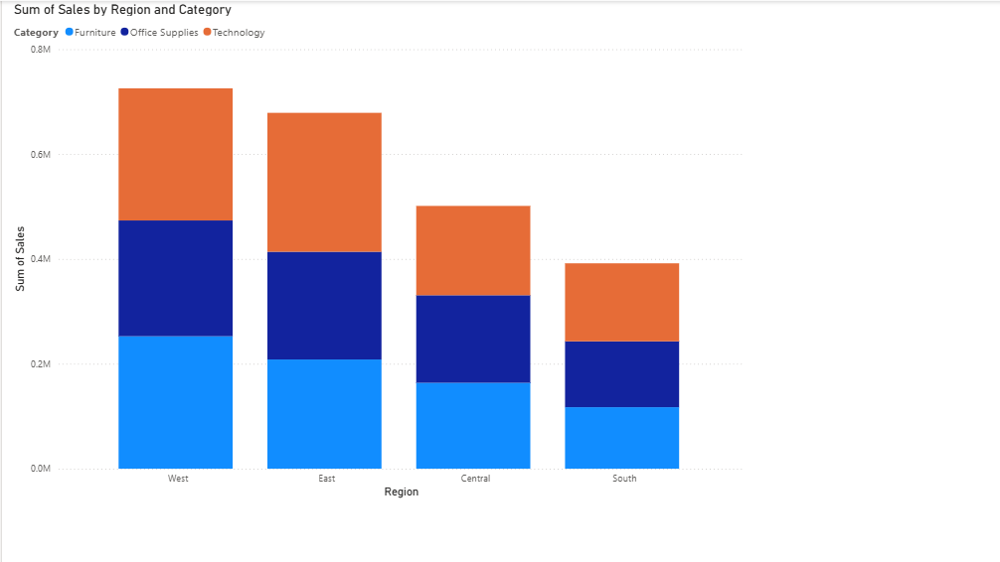
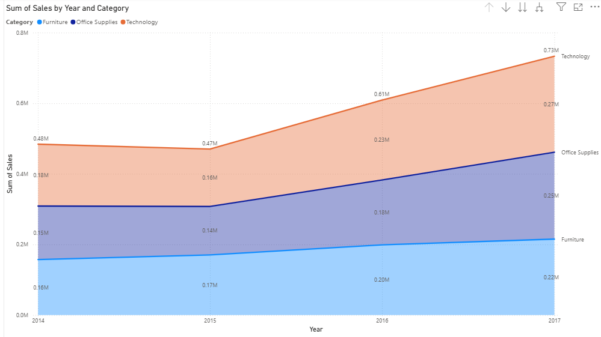
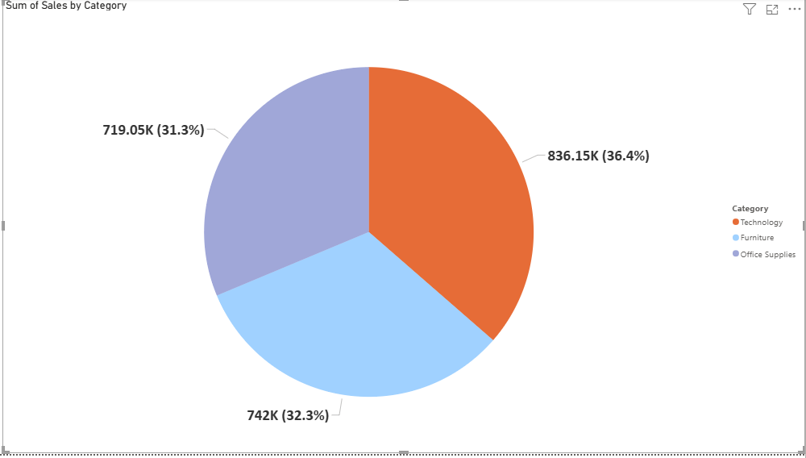
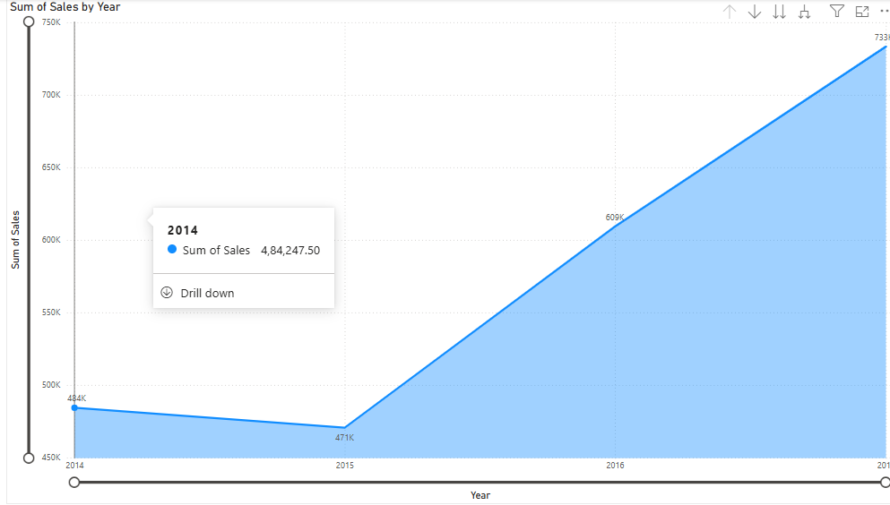
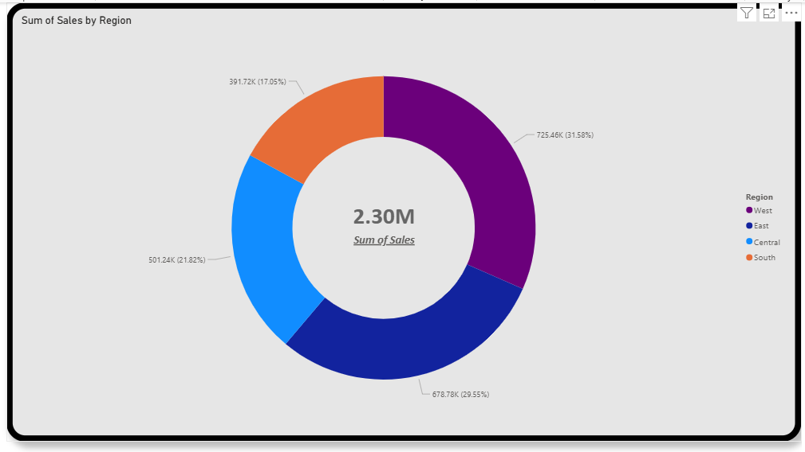
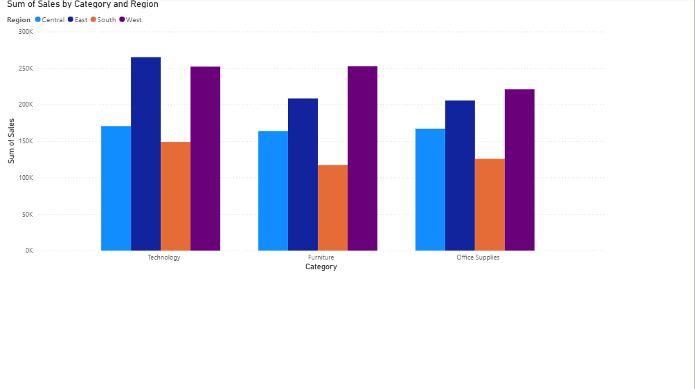
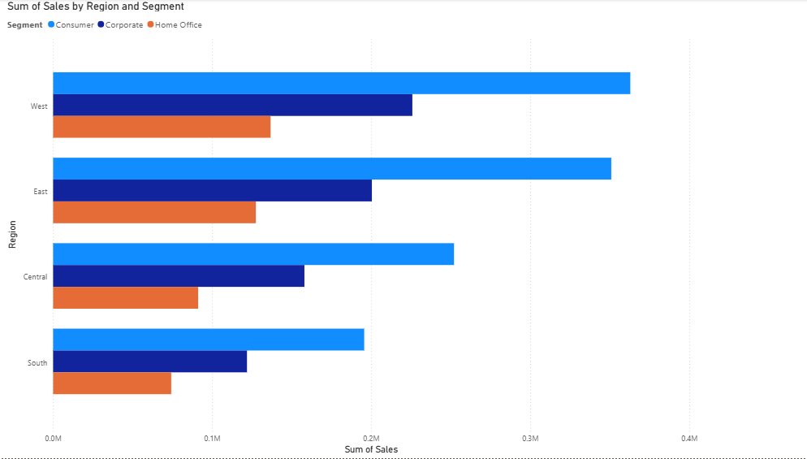
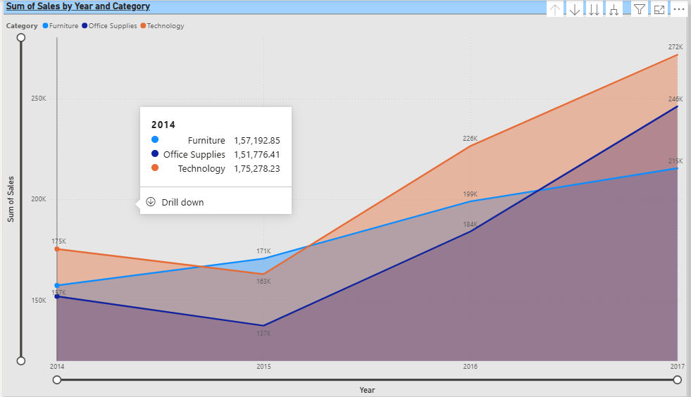
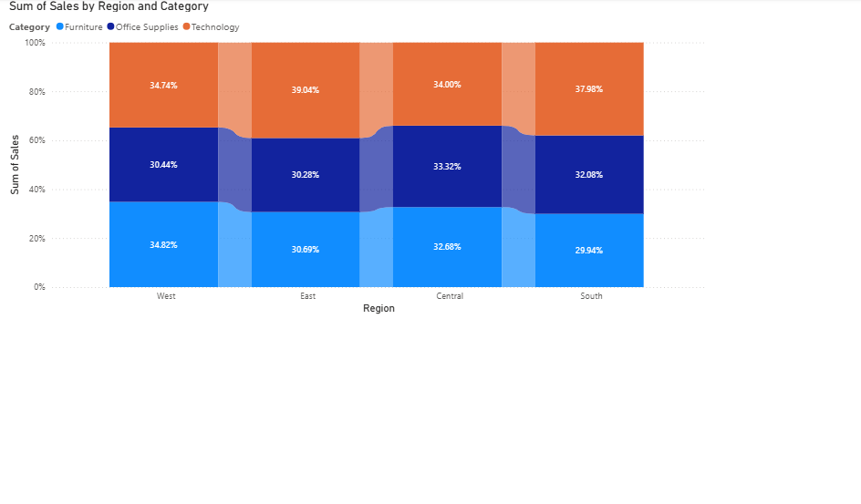
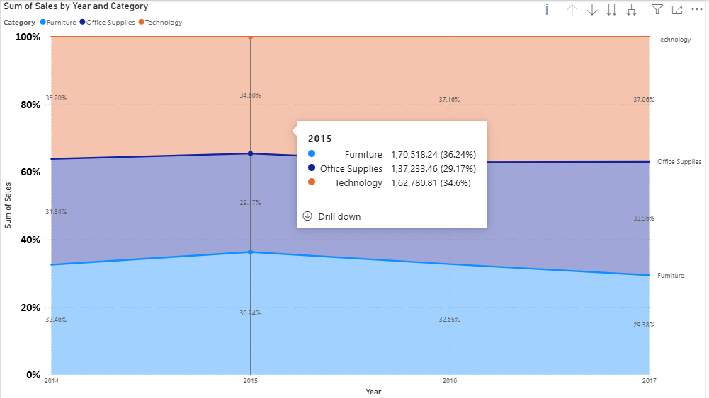

Welcome to my Business & Data-Analysis Portfolio:-
A structured Business $ Data Analysis Portfolio highlighting my journey through data tools (Excel, Power BI, SQL, Python, Tableau) and methodologies (Agile, SDLC, BRD/FRD, Jira, Confluence) — combining dashboards, worksheets, Modeling tools, Trello Notion and documentation to showcase practical skills for real‑world business problem solving.
It is designed to showcase my ability to combine analytical thinking, technical expertise, and business process knowledge into professional outputs.
# 📚 Topics Covered
- **Power BI**: Data visualization, Interactive reports, Business insights, Power Query Editor, Charts Types, Joints, Fuzzy Matches
-  **Excel**: Advanced formulas, pivot tables, dashboards, automation.
- **SQL**: Queries, joins, stored procedures, database management
- **Python**: Data cleaning, analysis, automation scripts
- **Tableau**: Interactive dashboards, storytelling with data
- **BRD/FRD Documentation**: Capturing and translating business requirements
- **Agile & SDLC**: Modern project management and development practices
- **Modeling Tools**: Business process modeling and workflow diagrams including Process Modeling, Data Modeling, Requirement Modeling. 
## 📊 Dashboards & Worksheets
This section contains dashboards and Excel worksheets created by me, demonstrating how raw data can be transformed into actionable insights for decision‑making.

## 💻 Code & Queries
- **SQL scripts**: Examples of database queries and analysis
- **Python scripts**: Data analysis and automation projects
---
## 📄 Documentation
- **BRD/FRD samples**: Requirement gathering and functional specifications
- **Agile/SDLC notes**: Understanding methodologies and project workflows
---
## 🎯 Purpose
This portfolio serves as:
- A **learning journal** documenting my progress
- A **portfolio** to showcase my skills
- A **reference** for future projects in business analysis and data analytics

---
## 📜 License
This project is licensed under the GNU GPL v2 (see LICENSE.txt).
## 📚 Power BI Dashboard
[Power BI Dashboard](Powerbi-Dashboard.png)
## 📚 Power BI Charts 

